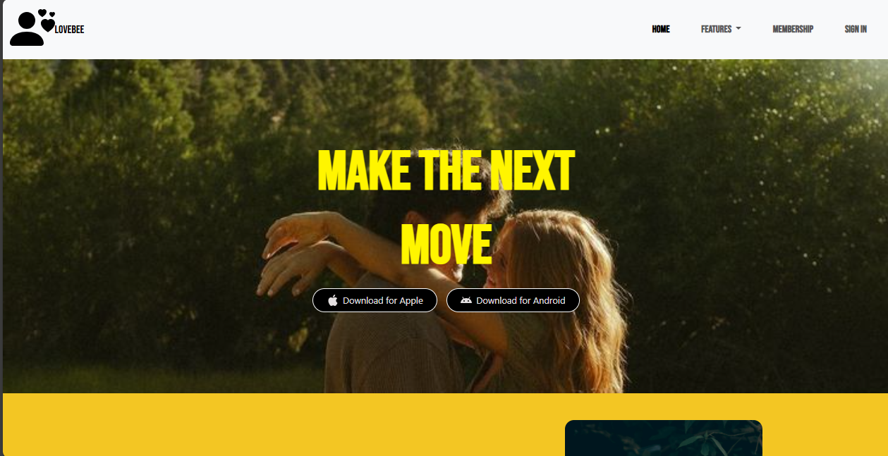

# BumbleBee – Tinder Clone Dating App UI

A beautifully crafted front-end UI clone inspired by popular dating apps like **Tinder** and **Bumble**. This project is built using **HTML**, **CSS**, and **Bootstrap** to ensure responsiveness and modern design aesthetics.

---

## 🚀 Features

- 💛 Modern and responsive landing page UI
- 📱 Download buttons with SVG icons (Apple & Android)
- 🎨 Clean color palette and consistent styling
- ⚡ Hover effects and bounce animations on icons

---

## 🛠️ Built With

- **HTML5**  
- **CSS3**  
- **Bootstrap 5**  
- **Google Fonts**  
- **SVG Icons (Bootstrap Icons)**

---

## 📸 Screenshots

## 👩‍💻 Author

**Rituja Dabhade**  
_If you like this project, feel free to give it a ⭐_

---

## 📝 License

This project is open-source and free to use for educational purposes.

